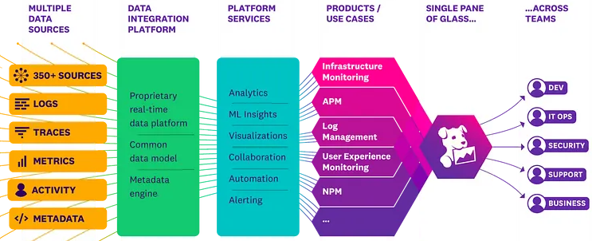

## Teknisk Studie - Datadog

### Vad är verktyget Datadog?
Datadog är framtaget för att både kunna analysera och övervaka. Datadog analyserar och övervakar applikationer, infrastrukturer och loggar i nutid. Genom Datadog kan data samlas in och koncentreras som fås från olika källor. Dessa källor kan till exempel vara tredjepartstjänster, containers, databaser eller olika servrar. Utifrån det här så kan verktyget hjälpa till med att ta fram en övergripande bild över hur systemet i fråga levererar i form av prestanda. Eftersom verktyget samlar in olika sorters data på ett gemensamt ställe kan användarna av Datadog enklare förstå komplicerade miljöer vilket i sin tur bidrar till fördelaktiga beslutstaganden. [1], [2]

### Vad gör verktyget Datadog?
Med hjälp av att använda verktyget Datadog kan information som förklarar systemets prestanda och olika beteenden redovisas. Det här sker genom att Datadog utgår från vissa nyckelmått som till exempel fel på applikationen, hur stor minnesanvändningen är och belastning på CPU. Datadog kan därefter bidra med visualisering för att enklare kunna identifiera återkommande värden och upptäcka problem innan det når slutanvändaren. Utöver det här bidrar Datadog även med att samla in loggar och erbjuda larmning i realtid. På så sätt kan användaren av Datadog frekvent och snabbt hållas uppdaterade vid noterade avvikelser vilket i sin tur bidrar till att öka systemets prestanda genom optimering. [1], [2]

### Inkorporering av Datadog
För att inkorporera verktyget Datadog i Microblog krävs att följande fem steg genomförs. 

1. För att använda Datadog behövs ett konto. Det här skapas genom att registrera sig på Datadogs webbplats https://www.datadoghq.com/signup/. Nästa steg är att logga in på plattformen för att kunna skapa en API-nyckel. Den här API-nyckel behövs för att autentisera Datadog agenten som sköter datainsamlingen. [3]

2. Nu behövs det att Datadog-agenten installeras på den servern där Microblog körs. Datadog erbjuder olika guider beroende på vilket system som är aktuellt via följande länk https://docs.datadoghq.com/agent/basic_agent_usage/ till exempel Docker, Windows eller Linux. [4]

3. När installationen är klar har agenten konfigurerats så att den kan påbörja datainsamlingen för att redovisa prestandan på servern. Den redovisar då nätverk, minne och CPU, men det finns även möjlighet för den att göra logginsamlingar från applikationen. [5]

    För att starta Agenten används följande:
    `sudo service datadog-agent start`

    För att stoppa Agenten används följande:
    `sudo service datadog-agent stop`

    Agentens status kan ses med hjälp av:
    `sudo datadog-agent status`

    Verifiering av konfigurerade integreringar för att se systemkontroller som att nätverk, minne och CPU är igång görs med:
    `sudo datadog-agent configcheck`

    För att lista mätvärden och systemdata används följande:
    `sudo datadog-agent metric list`

    Har det uppstått något tänkbart fel vid insamlingen av data kan det här felsökas med hjälp av:
    `sudo datadog-agent diagnose`

    Det går även att få realtidsdata rapporterade genom följande:  
    För CPU: `top`  
    För Nätverk: `iftop`  
    För minne: `free -m`  

4. Om loggar önskas bearbetas måste det specificeras var på servern de här loggarna finns att få tag på för att verktyget ska kunna ta till sig informationen och därefter redovisa resultatet visuellt. Ett sätt att göra det här på är att använda Datadogs egna användargränssnitt för att konfigurera, alternativt kan agentens konfigurationsfiler redigeras för att uppnå det här. [6]

5. När allt är installerat och klart bör genomförda moment verifieras. Det här görs genom att logga in på instrumentpanelen för att se så att all data från servern har skickats på korrekt sätt. Dashboards för att kunna hålla koll på det valda nyckelmåtten skapas för att därigenom kunna övervaka värdena. [7]

### Datadog i DevOps
Genom att Datadog erbjuder en övergripande bild av systemet för att därigenom redovisa hälsan och prestandan för systemet är det ett viktigt verktyg för utveckling enligt DevOps-principer. Det här är viktiga och grundläggande saker för att arbeta med ett CI/CD-flöde. Fördelen med att använda Datadog är att problem kan identifieras i tidigt stadie då Datadog erbjuder möjligheten att övervaka systemet samt att hantera loggarna. Datadog gör det också möjligt för data att visualiseras vilket ökar chanserna att lösa problem innan de riskerar att leda till eventuella driftstopp, på så sätt ökar pålitligheten för det aktuella systemet. Då Datadog innebär möjlighet för att övervaka infrastrukturen tillsammans med applikationen bidrar det här till ett förbättrat samarbete mellan deltagare i driftteamet och utvecklarna. Det här är i sin tur en viktig grund i att arbeta enligt DevOps, då det blir både mer effektiva och flexibla arbetsflöden. [8]

### Referenser
[1] “Getting started”, [Online]. Tillgänglig: https://docs.datadoghq.com/getting_started/ [Åtkomst: Dec. 03, 2024].  
[2] “Product”, [Online]. Tillgänglig: https://www.datadoghq.com/product/ [Åtkomst: Dec. 04, 2024].  
[3] “API Reference”, [Online]. Tillgänglig: https://docs.datadoghq.com/api/?tab=us#api-keys [Åtkomst: Dec. 04, 2024].  
[4] “Basic Agent Usage”, [Online]. Tillgänglig: https://docs.datadoghq.com/agent/basic_agent_usage [Åtkomst: Dec. 04, 2024].  
[5] “Basic Agent Usage For Debian”, [Online]. Tillgänglig: https://docs.datadoghq.com/agent/basic_agent_usage/deb/ [Åtkomst: Dec. 04, 2024].  
[6] “Log Collections and Integrations”, [Online]. Tillgänglig: https://docs.datadoghq.com/logs/log_collection/?tab=us [Åtkomst: Dec. 05, 2024].  
[7] “Widgets”, [Online]. Tillgänglig: https://docs.datadoghq.com/dashboards/widgets/ [Åtkomst: Dec. 04, 2024].  
[8] “DevOps Monitoring”, [Online]. Tillgänglig: https://www.datadoghq.com/solutions/devops/ [Åtkomst: Dec. 05, 2024].  

